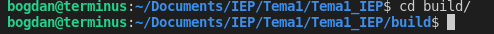
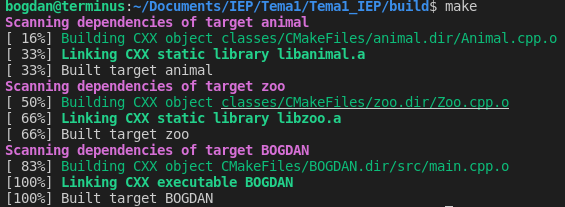
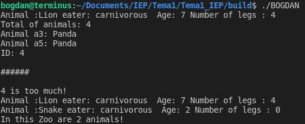

# Tema1_IEP
## Follow this instructions:
### 1.  Firstly you have to run `./remake.sh`

### 2.  Secondly go into the new directory, build, `cd build/`

### 3.  Now run `make` to make the executable, which is BOGDAN

### 4.  And finally run the executable `./BOGDAN`
